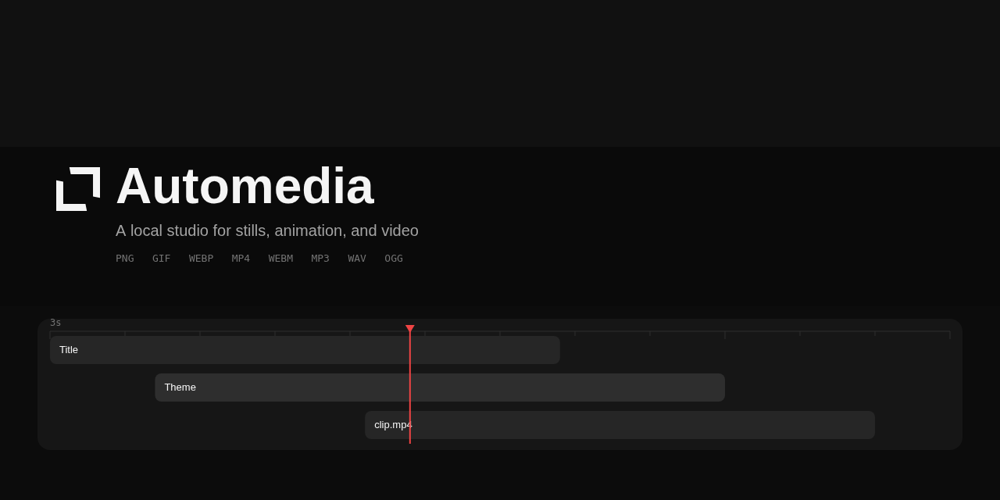
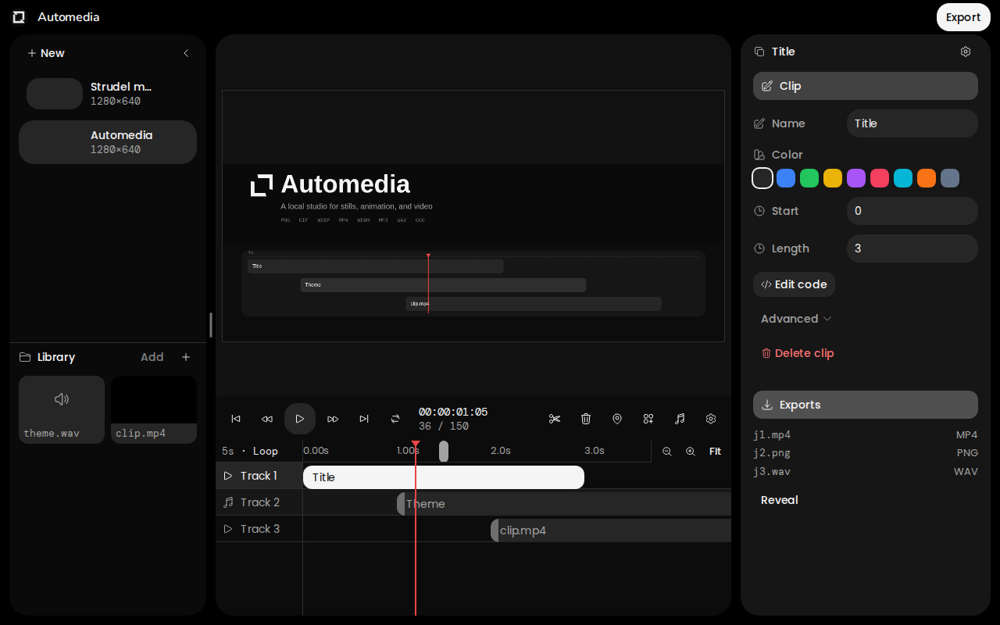
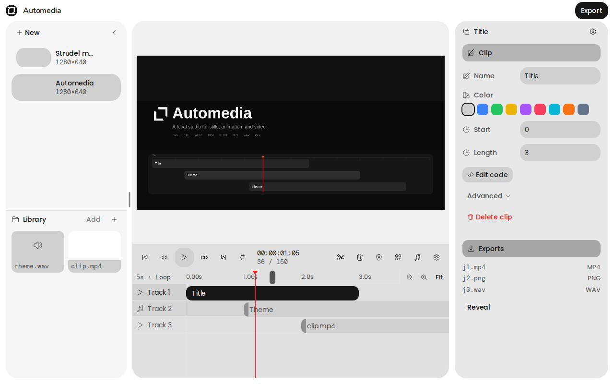
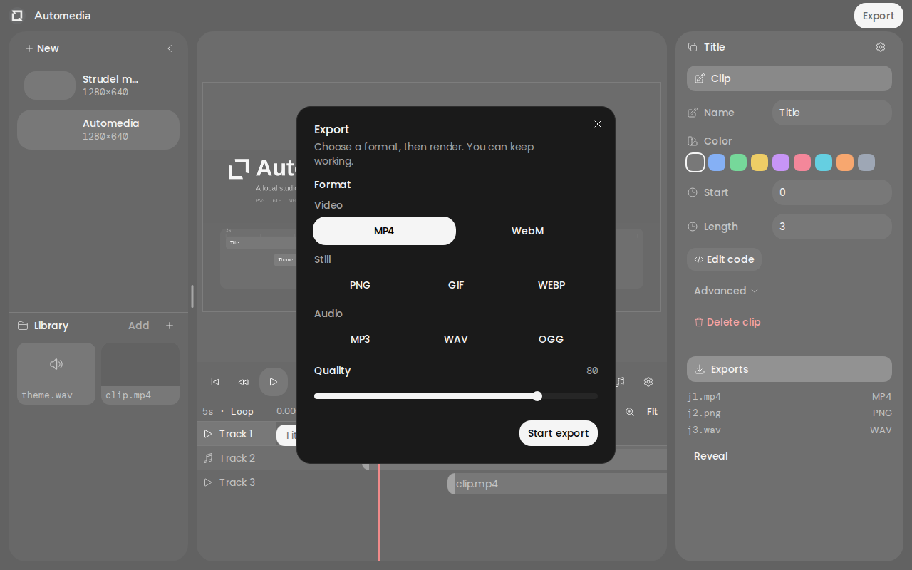
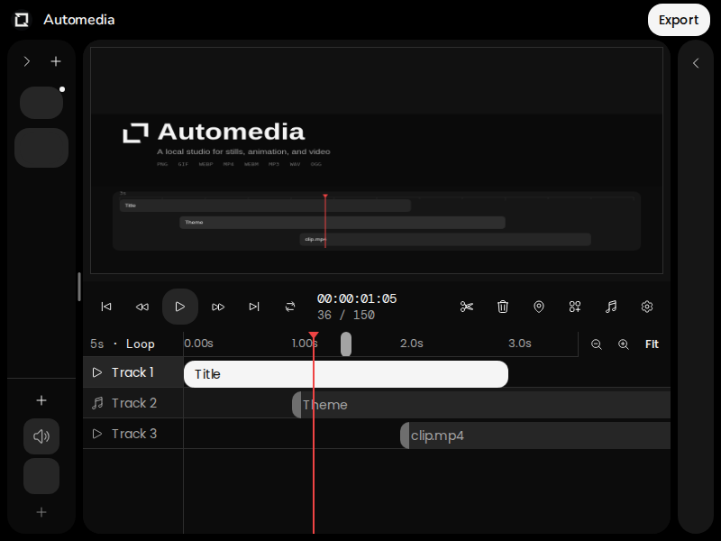

# Automedia



Automedia is a local Electron studio for authoring browser-based stills, animations, and videos. A project is an HTML, CSS, and JavaScript document with composition settings, optional media tracks, timeline markers, and controls.

The banner above is a PNG exported from Automedia — the same composition open in the studio shots below.

The app serves each project from a localhost loopback server, previews it in Chromium, and drives it with a frame-based clock. The same renderer powers validation and export, so a successful validation checks the document that export will capture.

Agents can author projects through MCP. People can use the studio to edit source, scrub the timeline, adjust settings and controls, inspect validation, and export files.

## Studio

Dark and light chrome at the default window size. Export groups formats as video, still, and audio. A compact 800×600 window collapses the sidebars.









Regenerate the banner through the real export queue:

```bash
README_BANNER=1 pnpm exec vitest run src/main/write-readme-banner.test.ts
```

## Requirements

- Node.js 22.12 or newer
- pnpm 11 or newer
- `sfw` (Socket Firewall) on `PATH`
- `ffmpeg` and `ffprobe` on `PATH`

FFmpeg must provide `libopenh264`, `aac`, `libvpx-vp9`, `libopus`, GIF `palettegen` and `paletteuse`, and `libwebp_anim`.

## Setup

The workspace only accepts packages that have been available for at least three days. Install dependencies through Socket Firewall, then install the Chromium binary used by validation and export:

```bash
PLAYWRIGHT_SKIP_BROWSER_DOWNLOAD=1 sfw pnpm install
pnpm exec playwright install chromium
```

## Run the studio

```bash
pnpm dev
```

`pnpm start` is an alias. When the app opens, use `New` in the project sidebar to create a blank project or one of the built-in examples. The examples cover CSS animation, registered renderers, Motion, Three.js, Tailwind browser utilities, media, Strudel music, controls, transparency, and a deliberately broken script for testing validation errors.

## Authoring model

New projects live in Electron's user-data directory:

```text
compositions/<composition-id>/
├── composition.json       # name, size, frame rate, duration, background
├── media.json              # audio/video/image/block/music tracks and markers
├── controls.json           # range, color, toggle, and select controls
├── blocks/<asset>/         # visual clip: index.html, style.css, script.js
├── music/<asset>/          # music clip: authored pattern.js
├── assets/                 # project-local media files
└── exports/                # completed export files
```

Save project writes a `.automedia` zip of the authored tree plus the sidebar thumbnail. Import project unpacks that file as a new library item with a new id. Exports, activity logs, and generated music runtime files stay out of the snapshot. The live project remains in user data.

Projects default to 800×600 at 30 fps for three seconds with a transparent background. Composition sizes can range from 1 to 16,384 pixels, frame rates from 1 to 240 fps, and durations up to one hour.

The studio edits visual-block HTML, CSS, and JS in code mode, and music patterns in a separate music editor. File writes use etags, so an agent or another process cannot silently overwrite a newer version. `composition.json` is managed through composition settings and cannot be written as a loose file. Music runtime HTML, CSS, and transport are generated and cannot be written as loose files.

### Runtime API

Automedia injects `window.automedia` into the project document. Use `registerRenderer` when a frame needs JavaScript-driven painting:

```js
const canvas = document.querySelector("canvas");
const context = canvas.getContext("2d");

window.automedia.registerRenderer(({ frame, width, height }) => {
  context.clearRect(0, 0, width, height);
  context.fillRect(frame * 4, 20, 40, 40);
});
```

The renderer context includes time in seconds and milliseconds, frame, fps, dimensions, duration, and current control values. The runtime also exposes `ready`, `seek`, `setControls`, `getDiagnostics`, and `getMediaDiagnostics`. Query `get_runtime_types` over MCP for the full TypeScript contract.

The bundled import map provides pinned versions of Three.js, Motion, the Tailwind browser build, Strudel (`@strudel/web`), and vGPU (`vgpu`). vGPU blocks can fetch project-local `.wgsl` files and draw deterministic WebGPU frames from `registerRenderer`. The built-in `vgpu-shader` example renders into an offscreen vGPU target and reads the pixels into a 2D canvas so Chromium captures the same frame in previews, thumbnails, and headless exports. Query `get_runtime_catalog` for the versions available to a project.

### Music

`create_music_block` (or Add music in the studio) adds a first-class `music` clip. Authors write one file, `music/<asset>/pattern.js`, that exports a Strudel pattern:

```js
import { add, note, perlin, sine, stack, voicings } from "@strudel/web";

// Official Strudel getting-started showcase, rewritten onto built-in synths.
export default function pattern(gain) {
  const drums = stack(
    note("c1")
      .s("sine")
      .struct("x")
      .decay(0.14)
      .sustain(0)
      .gain(0.5 * gain),
    note("g2")
      .s("triangle")
      .struct("[~ <x!3 x(3,4,2)>]")
      .decay(0.08)
      .sustain(0)
      .gain(0.28 * gain),
    note("c6")
      .s("square")
      .struct("x*8")
      .decay(0.025)
      .sustain(0)
      .lpf(9000)
      .gain(0.07 * gain),
  );
  const bass = note("<a1 b1*2 a1(3,8) e2>")
    .off(1 / 8, (x) => x.add(12).degradeBy(0.5))
    .add(perlin.range(0, 0.5))
    .superimpose(add(0.05))
    .decay(0.15)
    .sustain(0)
    .s("sawtooth")
    .gain(0.32 * gain)
    .cutoff(sine.slow(7).range(300, 5000));
  const chords = voicings("lefthand", "<Am7!3 <Em7 E7b13 Em7 Ebm7b5>>")
    .superimpose((x) => x.add(0.04))
    .add(perlin.range(0, 0.5))
    .note()
    .s("sawtooth")
    .gain(0.12 * gain)
    .cutoff(500)
    .attack(1);
  return stack(drums, bass, chords).slow(3 / 2);
}
```

The default is the official Strudel getting-started showcase, rewritten onto built-in synths so it works offline. The bassline, lefthand voicings, and Euclidean snare figure stay; dirt-sample drums become sine/triangle/square hits. The studio opens a music editor for that file. The runtime wrapper, playback, mute, and volume stay managed and are not part of the HTML/CSS/JS block flow. Music clips are unmuted. Agents edit the pattern with `write_file` on `music/<asset>/pattern.js`. Sample banks are optional and need a network.

## MCP and localhost services

Start the app before connecting an MCP client. The default Streamable HTTP endpoint is:

```text
http://127.0.0.1:47821/mcp
```

The app also exposes:

- `GET /health` for a local health check
- `GET /events` for server-sent studio and export events
- `GET /compositions/<id>/content/<path>` for rendered project files
- `GET /compositions/<id>/exports/<job-id>` for completed exports

All services bind to `127.0.0.1`. Chromium remote debugging is available at `http://127.0.0.1:47822` for local automation and inspection.

Override either port when needed:

```bash
AUTOMEDIA_LOOPBACK_PORT=49000 AUTOMEDIA_CDP_PORT=49001 pnpm dev
```

### MCP tools

- Projects: `list_compositions`, `get_composition`, `create_composition`, `update_settings`, `delete_composition`, `save_project`, `import_project`, `get_activity`, `list_examples`, `reorder_compositions`, `claim_composition`, `release_composition`, `workspace_status`
- Files: `list_files`, `read_file`, `write_file`, `delete_file`
- Media: `get_media`, `probe_media`, `create_block`, `create_music_block`, `put_track`, `delete_track`, `put_marker`, `delete_marker`
- Controls: `list_controls`, `put_control`, `delete_control`
- Runtime: `get_runtime_catalog`, `get_runtime_types`, `get_health`
- Quality and export: `validate`, `start_export`, `get_export`, `cancel_export`

`delete_composition` moves a project into `.trash`. `workspace_status` reports ffmpeg health, export jobs, and composition leases. Claim a composition before parallel writes. `start_export` runs validation first and queues jobs; one export runs at a time. Video and audio formats need a healthy ffmpeg. Supported formats are PNG, GIF, WebP, MP4, WebM, MP3, WAV, and OGG. PNG can capture a single time; GIF, WebP, MP4, and WebM render the full composition. MP3, WAV, and OGG export audio only. MP4 and WebM require even dimensions and an opaque background.

## Scripts

| Command                   | Purpose                                       |
| ------------------------- | --------------------------------------------- |
| `pnpm dev` / `pnpm start` | Start the Electron app and localhost services |
| `pnpm typecheck`          | Type-check the main process and renderer      |
| `pnpm lint`               | Run oxlint                                    |
| `pnpm fmt`                | Format with oxfmt                             |
| `pnpm fmt:check`          | Check formatting without changing files       |
| `pnpm check`              | Run lint, format checks, and typecheck        |
| `pnpm test`               | Run the Vitest unit and integration suite     |
| `pnpm package`            | Package the Electron app                      |
| `pnpm make`               | Build an AppImage and a zip archive           |

## Repository layout

```text
src/main       Electron main process, store, loopback server, MCP, validation, export
src/preload    Isolated contextBridge API
src/renderer   React studio UI and state
src/shared     Schemas, IPC contracts, clock, limits, and runtime types
fixtures       Media copied into media-backed examples
tools/oxlint   Local oxlint rules
```
